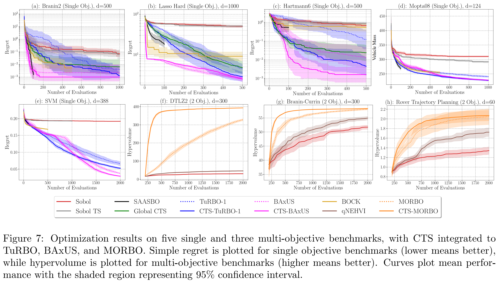

<div align="center">
  <h1>Cylindrical Thompson Sampling for High-Dimensional Bayesian Optimization
    

    
<a>AISTATS 2024 -- A novel sampling approach that boosts high-dimensional BO</a>

  <div>
      <a>Bahador Rashidi</a><sup>*</sup><sup>1</sup>,
      <a>Kerrick Johnstonbaugh</a><sup>*</sup><sup>1</sup>,
      <a>Chao Gao</a><sup>1</sup>,
  </div>
    


  <div>
  <sup>*</sup>Equal Contribution, <sup>1</sup>Huawei Canada - Edmonton Research Center,
       </div>   

<div>
   <a href="https://github.com/HW-AI-Research/CTS-HDBO"><strong>Paper Github Repo</strong></a>
   </div>   
    

<h2>Structure</h2> 

<div style="width: 100%; text-align: center; margin:auto;">
      
</div>
    
<h2>Open-Source HDBO Benchmark Results Results</h2> 
<div style="width: 75%; text-align: center; margin:auto;">
      
</div> 
 
</div> 


## Code Instructions
Install this package and its dependencies: 
```
pip install -e .
```
Run CTS-TuRBO on the Branin-500D function:
```
python cts/unified_benchmark_runner.py -a cts-turbo -f branin2-500d
```

Reproduce all results:
```
python tests/run_every_benchmark.py
```

You will find the results in the `results` directory.


## Contact

Please contact any of the follwing for technical inquiries.

- Bahador Rashidi, bahador.rashidi@huawei.com
- Kerrick Johnstonbaugh kjohnstonbaugh97@gmail.com
- Chao Gao, chao.gao4@huawei.com

## Citation

```bibtex
@article{CTSBO_2024,
  title={Cylindrical Thompson Sampling for High-Dimensional Bayesian Optimization},
  author={Bahador Rashidi, Kerrick Johnstonbaugh, Chao Gao},
  journal={AISTATS - Proceedings of the 27th International Conference on Artifitial Intelligence and Statistics},
  volume={238}
  year={2024},
}
```
